[中文](README.md) | [English](README.en.md)

# SheetNest · Rectangular Sheet Nesting and Cutting Result Review


**ZhiHua Technology (Shanghai Rujing Zhihua Information Technology Co., Ltd.)** · [Official website](https://www.zhuatech.cn/).

**Public source for learning / non-commercial use · 0.1.0.** The project's own code is governed by the [ZhuaTech Non-Commercial Source License 1.0](LICENSE). It is limited to personal learning, technical research and non-commercial exchange. Commercial use requires prior written authorization from Shanghai Rujing Zhihua Information Technology Co., Ltd. Public source does not imply an OSI open-source license; third-party components retain their own copyrights and licenses.

## What SheetNest is for

Before cutting rectangular parts, sheet dimensions, permitted orientation, margins and kerf need to be reviewed together. SheetNest is a Java 21 / Spring Boot / Vue 3 / MySQL application for learning and non-commercial workflow research involving a single rectangular sheet specification, such as wood, metal or plastic panels. It retains calculation inputs, historical layouts, independent plan approvals and manually observed physical results for recalculation and traceability.

Sheet purchasing, inventory, production scheduling and machine control are outside this release's scope. The layout is a bounded heuristic estimate, not a manufacturing-safety approval or a machine program.

Detailed documentation is currently in Chinese: [User manual](docs/操作手册.md), [API reference](docs/接口说明.md), [Architecture and data](docs/架构与数据.md), [Deployment and recovery](docs/部署与恢复.md), and [Security](SECURITY.md).

## From design to sealed results

```text
Define sheets and parts → Calculate nesting → Submit a complete layout
  → Independent approval and freeze → Open physical-result registration
  → Assigned operator acknowledges → Manually record good / scrap / uncut counts
  → Submit completion or stopping report → Independently review or return
  → Seal the observed outcome
```

Partially placed layouts must be revised before submission. Opening registration only changes the software record-keeping phase; it sends no machining commands. Plan editors, physical-result operators and reviewers are independent. A past editor cannot become an independent reviewer by switching roles.

## Implemented capabilities

| Module | Implemented behavior |
|---|---|
| Plan inputs | Unique reference, responsible department, material type/specification, sheet dimensions, edge margins, kerf, maximum sheets and assigned reviewer/operator |
| Rectangular demand | Up to 30 part types and 300 parts total; millimeter dimensions with at most one decimal place; explicit 90-degree rotation permission per type |
| Nesting | Original integer guillotine heuristic comparing eight sorting/splitting strategies; deterministic cutting tree, placements, kerf, offcuts and unplaced counts |
| Independent review | Input/calculation digest checks; submission only when every part is placed; assigned independent approval/return; approved inputs and layout freeze |
| Version history | Input JSON, layout JSON, algorithm version and SHA-256 per calculation; edited inputs invalidate the active layout while retaining readable/recomputable history |
| Physical results | Assigned operator acknowledgment followed by manual good, scrap and uncut counts; required anomaly explanations; unrecorded values remain blank rather than becoming zero |
| Report sealing | Per-part quantity conservation before submission; explicit completion/stopping declaration; independent review/return; retained all-good, shortfall or stopped outcomes |
| Diagrams and statistics | Per-sheet SVG, logical split order, square-meter area balance, authorized plan states and manually registered physical counts |
| Queries and exports | Authorized search, filters, sorting and pagination; complete JSON reports and dimensions/results CSV with formula-injection protection |
| Business/admin interfaces | Session login/logout and password changes; users, five roles, departments, menus, eight permissions, material dictionaries, settings and audit |
| Interface | Chinese/English, desktop/mobile layouts, actual empty states and feedback, official ZhiHua logo and a consultation entry |

### Business and administrative roles

The business workspace covers design, layout review, manual result registration, report review, statistics and authorized export. The administration area manages identities, departments, roles, menus, permissions, dictionaries and settings. Both remain subject to backend authorization.

| Initial role | Data and actions |
|---|---|
| Administrator | ALL-scope identity/catalog administration; business actions still require assignment and independence |
| Plan designer | Department plans, parts, calculations, submission, registration opening, cancellation and export |
| Independent reviewer | Department reading; approve/seal only assigned plans that the reviewer has not edited or executed |
| Physical-result operator | SELF scope; only assigned plans, acknowledgment, manual registration and report submission |
| Department reader | Department reading/export without business writes |

Account, department and permissions are checked on each request. Writes serialize authorization, then check UUID idempotency and the whole-plan version. Revocation, disabling or a password change cannot be bypassed through a cached successful response. An operator-only role remains restricted to assigned plans even with ALL scope. SELF relationships include creation, historical editing or explicit assignment and remain department-bound. Administrators cannot fill another unassigned operator's results or approve their own edits. Digests check consistency but cannot prevent a privileged database administrator from changing both data and digests.

## Nesting model and bounds

- `GUILLOTINE-PORTFOLIO-1` sorts demand deterministically by area, longest side, width or height, each with vertical-first and horizontal-first splitting. Candidate free rectangles use remaining short/long sides and stable identifiers. The eight results are compared by placed count, then sheet count, then kerf area. This is not a global optimum solver.
- Each split crosses the current sub-sheet and consumes the complete kerf width. No split is needed when no remainder remains. A positive remainder smaller than the kerf conservatively rejects that placement. Explicit zero kerf is supported.
- Internal dimensions are integer 0.1 mm ticks; internal area units are 0.01 mm². Diagrams/split tables show millimeters; area balances show m². Parts + kerf + offcuts + margins equal the area of actually used whole sheets. Utilization is part area divided by used-sheet area, not the maximum permitted sheet count.
- Rotation is a manual permission. Fixed orientation retains original width/height; permitted rotation may swap them. Material/thickness descriptions are text, with no automatic physical-property, grain, mixed-material or machining-feasibility decision.
- One plan uses one sheet specification: dimensions 1–50,000 mm; margins 0–2,000 mm and less than half each sheet dimension; kerf 0–100 mm; 1–30 sheets. There are at most 50 historical calculations, 100–1,000 plans according to settings and 10,000 successful business request keys.
- Logical split order is a preorder traversal of the tree. It excludes margin-processing operations, equipment sequencing and mechanical safety parameters. Offcuts are remaining rectangles, not automatic inventory, saleable stock or guaranteed reusable material.
- A completion declaration containing scrap/uncut parts seals as `SHORTFALL`; all-good completion as `COMPLETED`; explicit stopping as `STOPPED`. Every outcome requires complete manual registration and does not infer that machining actually happened.

The [original RectangleBinPack project](https://github.com/juj/RectangleBinPack) distinguishes exact and approximate packing methods; the [guillotine-cutting reference](https://fontanf.github.io/packingsolver/rectangleguillotine.html) describes cuts crossing the current piece of sheet. SheetNest implements its own bounded heuristic, does not copy those projects' code and does not claim equivalent solving capabilities.

## Actual running pages

The screenshots show isolated `TEST` records in the running application. A normal first start has an empty business database.

| Workspace | Plans and results |
|---|---|
| 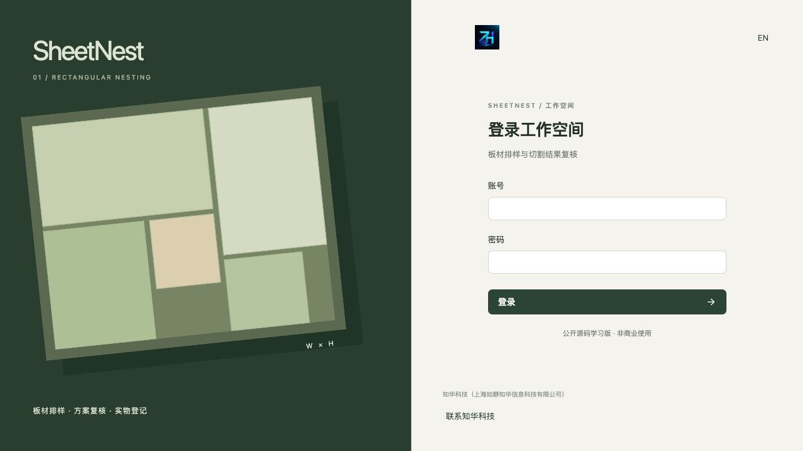<br>**Login:** session authentication into the workspace. | 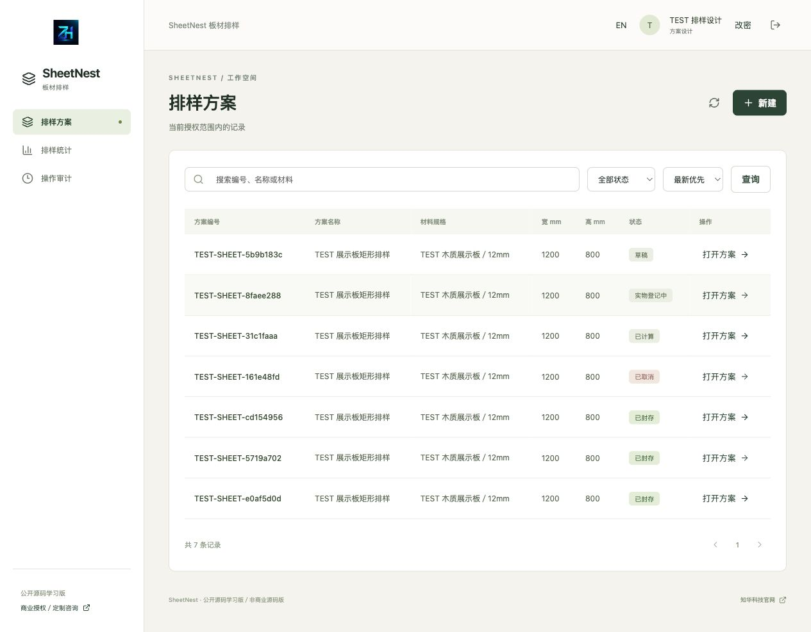<br>**Workspace:** authorized plans and their states. |
| 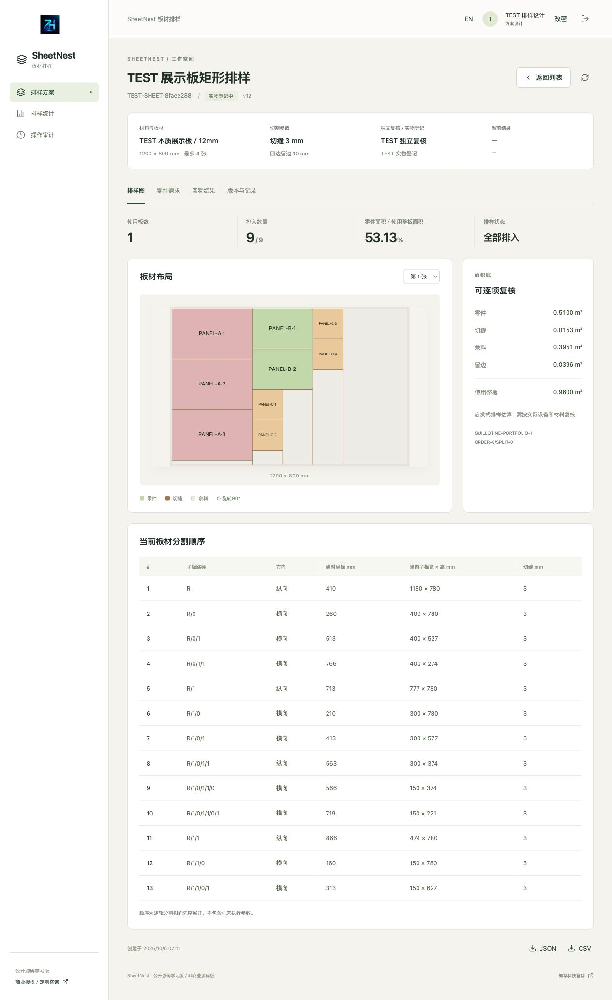<br>**Layout:** placements, kerf, offcuts and area balance. | 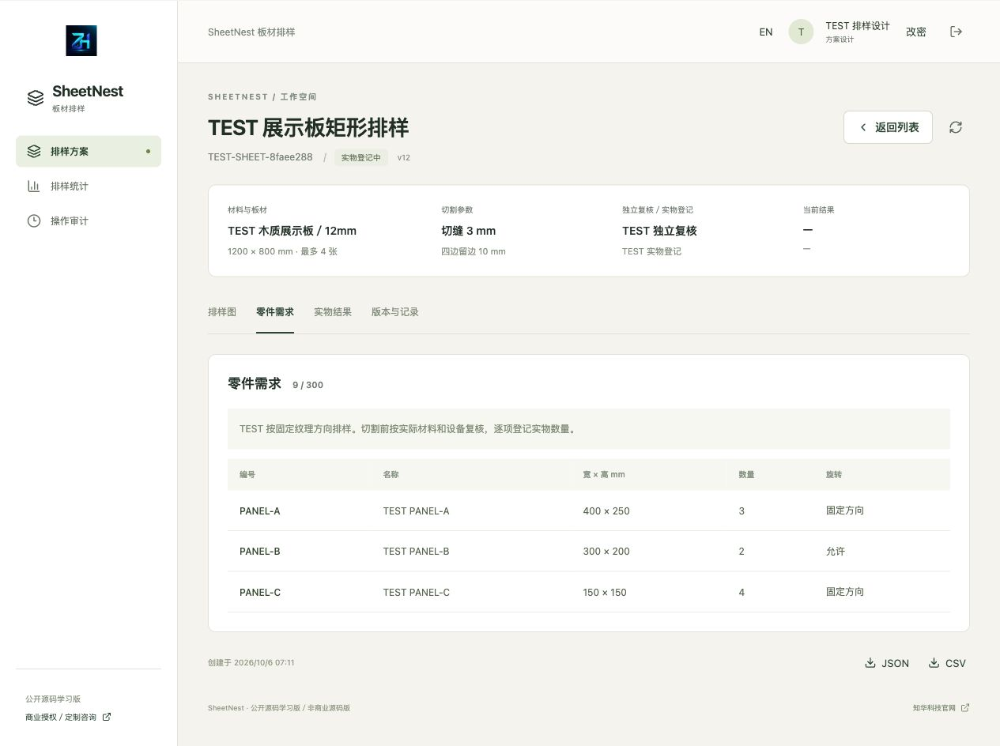<br>**Parts:** dimensions, quantities and rotation permission. |
| 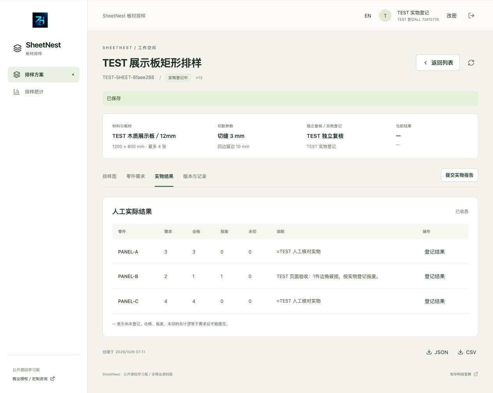<br>**Results:** manually register good, scrap and uncut counts. | 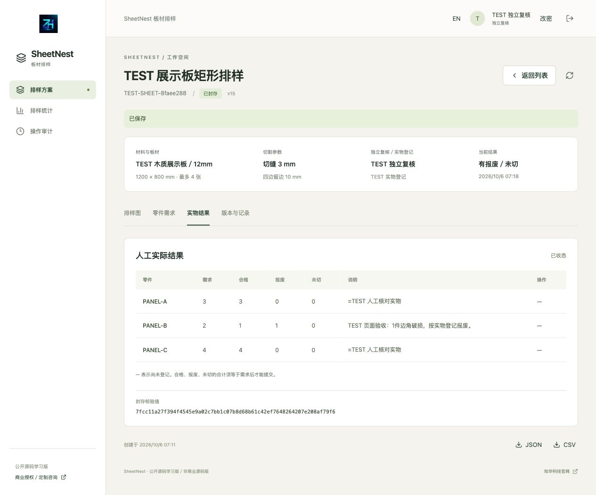<br>**Sealing:** inspect the independently reviewed outcome. |
| 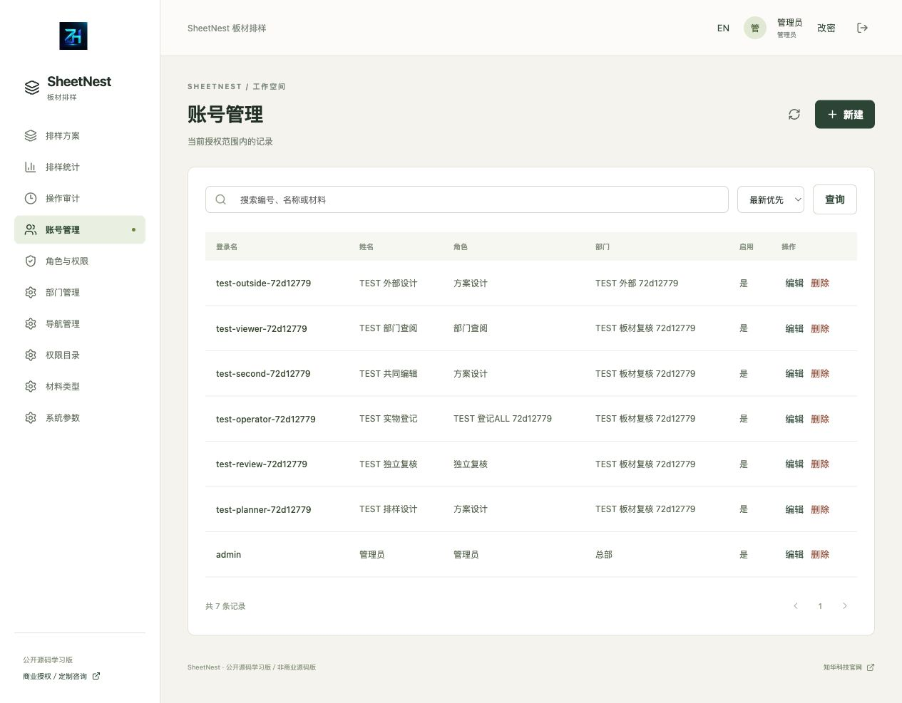<br>**Users:** accounts, departments and roles. | 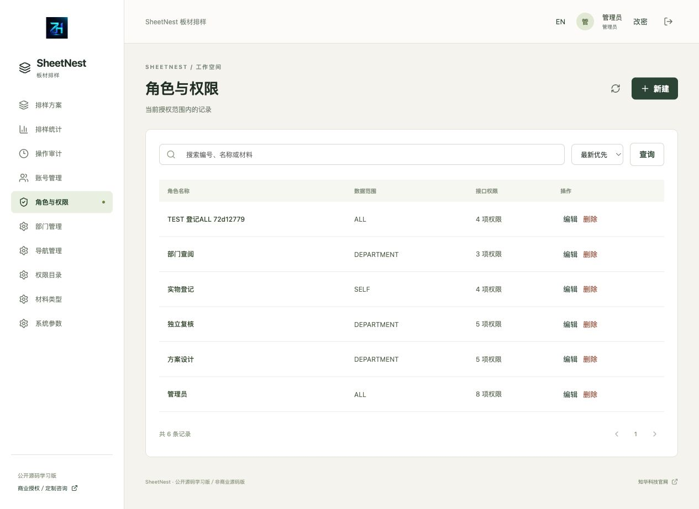<br>**Roles:** interface permissions and data scopes. |
| 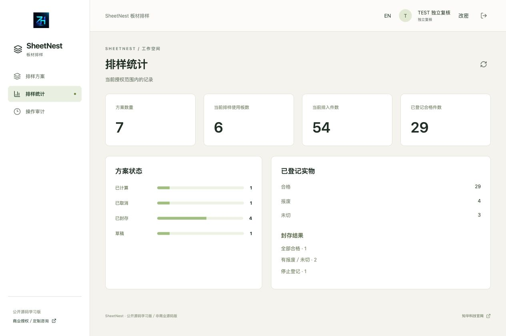<br>**Statistics:** authorized plan states and recorded physical counts. | 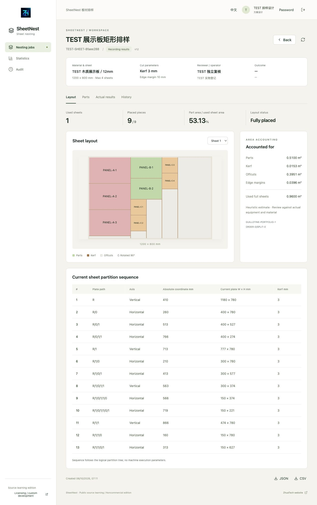<br>**English UI:** English operation pages. |
| 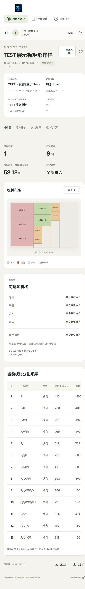<br>**Mobile UI:** narrow-screen plan viewing and operations. | |

## Architecture, structure and database

| Component | Versions and constraints |
|---|---|
| Backend | Java 21, Maven 3.9, Spring Boot 4.0.7, Security, JPA, Flyway, MariaDB JDBC 3.5.10 |
| Frontend | Node 24.19.0, npm 11, Vue 3.5.40, Vite 8.1.5, Lucide 1.48.0, ESLint/Prettier |
| Database | MySQL 8.4 (MySQL 8 family); 16 identity/business tables plus Flyway history; versioned SQL creates the schema and JPA only validates it |
| Deployment | Compose with MySQL, Java and Nginx; no database/backend host ports; frontend defaults to loopback port 8132 |
| Time | UTC microsecond facts; interface uses Asia/Shanghai; restarting does not reinitialize business data |

```text
backend/src/main/java/cn/zhuatech/sheetnest/  Identity, nesting, business logic and API
backend/src/main/resources/db/migration/    V1 identity / V2 nesting and results
backend/src/test/                           HTTP/JPA and independent geometry tests
frontend/src/                              Pages, forms, permitted actions, API and tests
frontend/public/brand/                     Original brand assets
docs/                                     Manuals, architecture, API, deployment and actual screenshots
scripts/                                  Random configuration, isolated acceptance and release checks
compose.yaml                              Complete local deployment
```

Migrations are `V1__identity.sql` and `V2__sheet_nesting.sql`. An empty database initializes headquarters, five roles, eight permissions, ten menus, four material types, three settings and `admin`; it creates no plans, parts, layouts or physical records. Foreign keys protect account/department/business history. References, part codes, results and request keys have database constraints. Transactions check states, assignments, quantity conservation and digests.

## Run the complete application

Requirements: Docker, Docker Compose 2 and Python 3.11+. Network builds need official container images, Maven Central and npm.

```bash
python3 scripts/init-env.py
docker compose config --quiet
docker compose up --build -d --wait
```

Open [http://127.0.0.1:8132/](http://127.0.0.1:8132/). The [health endpoint](http://127.0.0.1:8132/actuator/health) includes `"status":"UP"`. The initial username is `admin`; read `ADMIN_PASSWORD` from the locally generated, Git-ignored `.env`. The script writes random configuration with mode 0600 and refuses to overwrite it. There is no fixed public password. Changing environment variables does not reset existing database accounts.

Create separate designer, independent reviewer and result-operator accounts in the same department before creating plans. Do not use actual customer manufacturing data in public demonstrations.

### Configuration

| Name | Purpose |
|---|---|
| `DATABASE_PASSWORD` | Required MySQL application password |
| `MYSQL_ROOT_PASSWORD` | Required local database administration password |
| `ADMIN_PASSWORD` | Required only for initial administrator creation in an empty database |
| `WEB_PORT` | Defaults to 8132; an alternative is `WEB_PORT=18132 docker compose up -d --wait` |
| `BIND_ADDRESS` | Defaults to 127.0.0.1, loopback only |
| `COOKIE_SECURE` | `false` for local HTTP; `true` behind trusted external HTTPS |
| `DATABASE_URL`, `DATABASE_USER`, `DATABASE_CATALOG` | Backend-process overrides for source development; the Compose internal connection is already configured |

`docker compose down` retains the database volume. Use `down -v` only for an explicitly disposable test database, never an existing business database. Backend image builds run all tests without skipping them.

### Source development

Provide Java 21, Maven 3.9 and a local MySQL database; set backend database configuration and `ADMIN_PASSWORD`:

```bash
cd backend
mvn spring-boot:run
```

In another terminal, start at the repository root and use Node 24.19.0 / npm 11:

```bash
cd frontend
npm ci
npm run dev
```

Vite proxies `/api` and `/actuator` to 127.0.0.1:8080. See [Deployment and recovery](docs/部署与恢复.md) for details.

## Validation and upgrades

```bash
cd backend
export TEST_ADMIN_PASSWORD="$(python3 -c 'import secrets; print("Aa9" + secrets.token_urlsafe(24))')"
mvn spotless:check test package
unset TEST_ADMIN_PASSWORD
cd ../frontend
npm ci
npm run format:check
npm run lint
npm test
npm run build
cd ..
docker compose config --quiet
python3 scripts/release-check.py
git diff --check
```

The backend has 36 tests: 24 HTTP/JPA tests for states, scopes, revocation, idempotency, concurrency, strict dimensions and manual counts; 12 algorithm tests include independent geometry checks over 120 fixed-seed scenarios. The frontend has 12 tests for requests/CSRF, roles/states, explicit zero values, missing counts, dimension precision and units. The isolated MySQL suite exercises seven plans, normal/shortfall/stopped outcomes, returns/revisions, scopes, concurrency, CSV, geometry and area balances, with 2,294 assertions.

`TEST_ADMIN_PASSWORD` is a temporary random password for backend tests only, not the running application's administrator password. Do not put it in source files or reuse actual business credentials.

```bash
# Only for a fresh, independent, disposable loopback test instance.
# This writes TEST accounts and business records.
python3 scripts/smoke.py --allow-test-writes
python3 scripts/smoke.py --capture
# Verify after restarting or restoring into an independent database:
python3 scripts/smoke.py --verify
# Override the independent URL with TEST_URL=http://127.0.0.1:18132
```

Private `output/qa-state.json` contains random test passwords and comparison snapshots, has mode 0600 and is Git-ignored. Do not publish it. Back up before upgrades and verify migrations independently. Add new Flyway versions; do not modify published migrations, disable validation or automatically repair history. Recovery steps are in the [deployment manual](docs/部署与恢复.md).

| Problem | Action |
|---|---|
| Port occupied | Override `WEB_PORT`; do not stop another project's containers |
| Partially placed layout | Inspect unplaced counts; revise sheets, quantities, rotation or maximum sheets before submission |
| Layout disappears after edits | Recalculate; input changes invalidate the active layout, while history remains available |
| No selectable reviewer/operator | Use enabled same-department accounts with appropriate permissions, independent of the editor |
| Results cannot be submitted | Explicitly record all three counts for every part; their total must equal demand, with anomaly explanations |
| Version conflict | Refresh before reopening the form |
| Changed initial password has no effect | `ADMIN_PASSWORD` only initializes an empty database; use the authorized password-change flow for existing accounts |
| Build/migration failure | Inspect restricted local logs and fix the cause; do not skip tests, clear existing databases or edit published SQL |

## Deployment, security and limitations

Security controls include BCrypt with 12 rounds, HttpOnly/SameSite Strict session cookies, CSRF, login rate limiting, live authorization/scopes, transaction locks/versions, bounded inputs, parameterized database operations and CSV formula-injection protection. External deployment requires trusted HTTPS, controlled proxy forwarding headers, network policies, restricted database accounts and tested backups/restores. Sessions are in the Java process; a restart requires login again, while database facts persist. No independent production-readiness certification is claimed.

This release does not provide global optimization, mixed sheet specifications, irregular shapes, automatic grain recognition, defect avoidance, price optimization, inventory linkage, production work orders, G-code, fixture/feed parameters, machine interfaces or equipment-safety certification. It has no preloaded business cases, simulated machining or third-party-service demonstration mode; the core workflow uses a real database. No AI credentials, external accounts or equipment configuration are required. External HTTPS and backup storage are configured by the deployer. Multi-tenancy, external tamper-proof signatures and high availability are not implemented.

Algorithms, digests and human review do not replace assessment of actual materials, equipment, machining safety or product quality. Do not publish passwords, customer data, equipment documentation or unredacted backups.

## License, contributions and contact

See [CONTRIBUTING](CONTRIBUTING.md) for contributions and use redacted issues for general feedback. For security concerns, consult [SECURITY](SECURITY.md) and contact ZhiHua privately. Third-party components retain their own licensing requirements. The root [LICENSE](LICENSE) governs the project's own code: personal learning, research and non-commercial exchange only; commercial use requires prior written authorization from Shanghai Rujing Zhihua Information Technology Co., Ltd.

For commercial licensing, private deployment, system integration or in-depth custom development, contact **ZhiHua Technology (Shanghai Rujing Zhihua Information Technology Co., Ltd.)**:

- Website: [https://www.zhuatech.cn/](https://www.zhuatech.cn/)
- Email: [han@zhuatech.cn](mailto:han@zhuatech.cn)
- Email: [jack@zhuatech.cn](mailto:jack@zhuatech.cn)
- WhatsApp: [+86 17521234993](https://wa.me/8617521234993)
